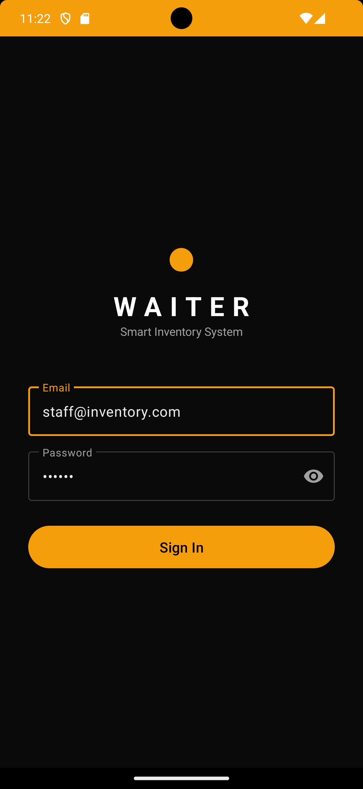
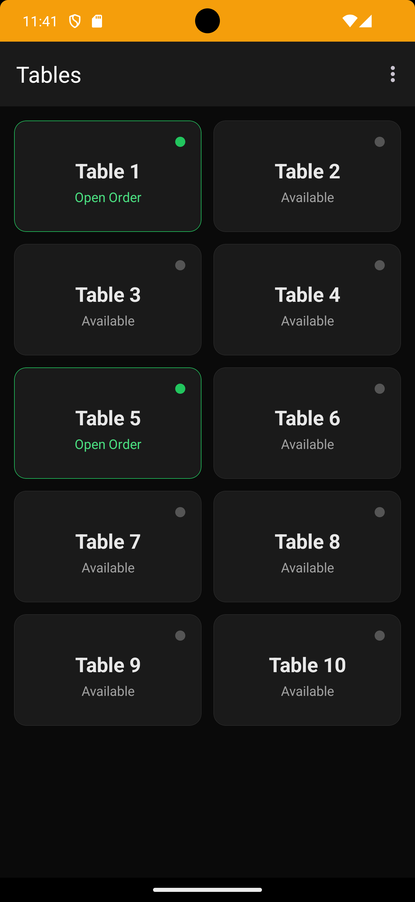
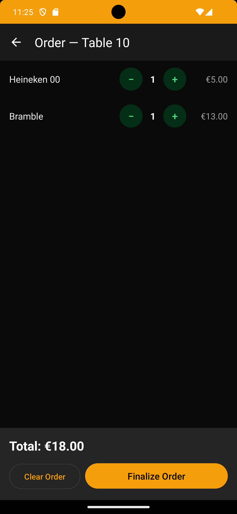

# WaiterApp — Mobile Waiter POS

> **BSc Computer Science - Final Year Project**
> Dorset College Dublin, Ireland | 2025–2026
> **Author:** Fernando Moraes

A native Android app that gives front-of-house staff a fast, touch-friendly POS experience backed by Firebase Firestore. Waiters browse the menu, build orders, and finalize them — triggering automatic inventory deduction via the Smart Inventory System.

---

## Screenshots

| Tables | Menu | Order |
|--------|------|-------|
|  |  |  |

---

## User Flow

```
LoginActivity
    └── TablesActivity       (2-column grid; green dot = active order)
            └── MenuActivity (collapsible categories; inline qty; sticky order bar)
                    └── OrderActivity (qty controls; clear/finalize; → Tables)
```

---

## Features

| Feature | Detail |
|---------|--------|
| **Dark Material 3 theme** | Black-based palette (`#0A0A0A` background, amber accent) forced day/night |
| **Table status grid** | 2-column card grid; green dot + border = open order; natural numeric sort (Table 1, 2 … 10) |
| **Collapsible menu categories** | Tap header to expand/collapse; animated chevron; first category auto-expanded |
| **Category chip bar** | Horizontal scrollable chips jump + auto-expand the target section |
| **Inline qty controls** | `[-][qty][+]` per item; optimistic UI (instant feedback before Firestore confirms) |
| **Sticky order bar** | Shows total items + price; hides when cart is empty |
| **Out-of-stock items** | Dimmed (45% alpha) with "Out of stock" label; qty controls hidden |
| **Sequential order IDs** | `order_001`, `order_002` … via Firestore counter transaction |
| **Inventory auto-deduction** | `FinalizeOrderService` runs a transaction: reads recipes → deducts ml from stock → closes order → returns `StockWarning` list |
| **Stock warnings** | Post-finalize warnings shown for items below threshold |

---

## Tech Stack

- **Kotlin** — Native Android (min SDK 24, target SDK 34)
- **Firebase Authentication** — Email/password login
- **Firebase Firestore** — Real-time database; direct SDK (no backend)
- **Material 3** (`Theme.Material3.Dark.NoActionBar`) — All UI components
- **RecyclerView** — Multi-view-type adapter for menu (Header + Item rows)
- **Android JUnit** — Unit tests for `OrderLine`, `StockCalculator`, etc.

---

## Firestore Data Model

```
tables/{id}
  name, active

orders/{id}              ← order_001, order_002 …
  table, status ("open"|"closed"), createdAt, closedAt

orders/{id}/items/{id}   ← item_001, item_002 …
  menuItemId, name, unitPrice, qty, status

menuItems/{id}
  name, price, category, active, isAvailable
  recipe: [{ inventoryId, qtyMl }]

inventory/{id}
  name, stockItems, sizeMl, openMl, minOpenMlWarning

counters/orders          ← sequential ID counter
  count
```

---

## Build & Run

```bash
cd mobile-waiter-app/WaiterApp

# JVM unit tests (no emulator needed)
./gradlew test

# Instrumented tests (emulator / device)
./gradlew connectedAndroidTest

# Run single test class
./gradlew test --tests "com.example.waiter_app.OrderLineTest"

# Build debug APK
./gradlew assembleDebug
# Output: app/build/outputs/apk/debug/app-debug.apk
```

> **Java:** requires JDK 21. Set `JAVA_HOME` to the JDK directory (not the `.exe`).

---

## Project Structure

```
WaiterApp/app/src/main/
├── java/com/example/waiter_app/
│   ├── LoginActivity.kt           # Firebase email/password auth
│   ├── TablesActivity.kt          # Table grid; open-order status
│   ├── TablesAdapter.kt           # Card binding; status dot colour
│   ├── Table.kt                   # data class — id, name, hasOpenOrder
│   ├── MenuActivity.kt            # Collapsible menu; order creation
│   ├── MenuAdapter.kt             # Header + Item view types; chevron anim
│   ├── MenuItem.kt                # data class — id, name, price, category, isAvailable
│   ├── MenuRow.kt                 # sealed class Header | Item
│   ├── OrderActivity.kt           # Order review; clear/finalize
│   ├── OrderAdapter.kt            # Order item rows with qty controls
│   ├── OrderLine.kt               # data class — itemId, name, qty, unitPrice
│   └── services/
│       └── FinalizeOrderService.kt  # Firestore transaction: recipes → inventory deduction
├── res/
│   ├── layout/
│   │   ├── activity_login.xml
│   │   ├── activity_tables.xml
│   │   ├── item_table.xml         # MaterialCardView with status dot
│   │   ├── activity_menu.xml      # Toolbar + ChipGroup + RecyclerView + order bar
│   │   ├── item_menu_header.xml   # Collapsible header with chevron
│   │   ├── item_menu.xml          # Item row with inline [-][qty][+]
│   │   ├── activity_order.xml     # Order review with totals + action buttons
│   │   └── item_order.xml         # Order line with qty controls
│   ├── drawable/
│   │   ├── circle_dot.xml         # Status dot (tinted dynamically)
│   │   └── ic_chevron_down.xml    # Animated expand/collapse indicator
│   ├── menu/
│   │   └── menu_tables.xml        # Toolbar overflow: Logout
│   └── values/
│       ├── colors.xml             # Full Material 3 dark palette
│       └── themes.xml             # Theme.Material3.Dark.NoActionBar
```

---

## License

Academic use only. Developed as part of BSc Computer Science coursework at Dorset College Dublin.
